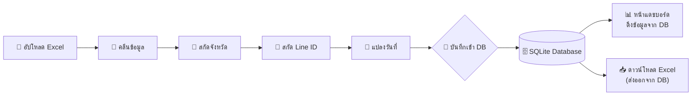

# แผนการทำ Database สำหรับระบบประมวลผลข้อมูล กอง ปท.

## สรุปภาพรวม

เปลี่ยนระบบจาก **"อัปโหลดไฟล์ทุกครั้ง → ประมวลผล → ดูกราฟ"** เป็น **"อัปโหลดครั้งเดียว → คลีน → เข้า DB → หน้าแดชบอร์ดดึงจาก DB ได้เลย"**

ทำให้ระบบ **เสถียรและเร็วขึ้น** เพราะไม่ต้องประมวลผลซ้ำทุกครั้ง ข้อมูลเก่าสะสมไว้ใน Database สามารถค้นหา กรอง และเปรียบเทียบข้ามไฟล์ได้ทันที

---

## User Review Required

> [!IMPORTANT]
> **การเลือก Database Engine:** แนะนำ **SQLite** เนื่องจาก:
> - ไม่ต้องติดตั้ง Database Server แยก (ทำงานเป็นไฟล์เดียว `.db`)
> - เหมาะกับระบบ Standalone ที่รันบนเครื่องเดียว ตรงกับบริบทโปรเจกต์
> - Python มี `sqlite3` มาให้ในตัว ไม่ต้องติดตั้งเพิ่ม
> - รองรับข้อมูลหลักแสน-หลักล้านแถวได้สบาย (**เร็วกว่าอ่าน Excel ทุกครั้ง 10-50 เท่า**)
> - สามารถอัพเกรดเป็น PostgreSQL ในอนาคตได้ง่ายโดยแก้โค้ดน้อยมาก (ใช้ SQLAlchemy เป็น abstraction layer)

> [!WARNING]
> **Breaking Change:** หน้าแดชบอร์ด (สร้างกราฟ) จะเปลี่ยนจากการอัปโหลดไฟล์ เป็นการ **เลือกข้อมูลจาก Database** แทน ผู้ใช้จะไม่ต้องอัปโหลดไฟล์ที่หน้ากราฟอีกต่อไป

---

## Proposed Changes

### 1. Database Schema Design (ออกแบบตาราง)

ออกแบบ 3 ตารางหลัก:

```
┌─────────────────┐      ┌──────────────────────────┐
│  upload_batches  │      │         posts            │
│─────────────────│      │──────────────────────────│
│ id (PK)         │──1:N─│ id (PK)                  │
│ filename        │      │ batch_id (FK)             │
│ uploaded_at     │      │ publisher (ผู้เผยแพร่)     │
│ total_rows      │      │ post_content (เนื้อหา)    │
│ cleaned_rows    │      │ province                  │
│ provinces_found │      │ line_contact              │
│ line_ids_found  │      │ date_collected            │
│ status          │      │ source_sheet              │
│ notes           │      │ channel                   │
└─────────────────┘      │ ... (คอลัมน์อื่นๆ)        │
                         └──────────────────────────┘

                         ┌──────────────────────────┐
                         │    processing_logs       │
                         │──────────────────────────│
                         │ id (PK)                  │
                         │ batch_id (FK)            │
                         │ step_name                │
                         │ status (success/error)   │
                         │ message                  │
                         │ rows_affected            │
                         │ created_at               │
                         └──────────────────────────┘
```

#### ตาราง `upload_batches` — ประวัติการอัปโหลดไฟล์
| คอลัมน์ | ชนิด | คำอธิบาย |
|---------|------|---------|
| `id` | INTEGER (PK) | รหัสชุดข้อมูล (Auto increment) |
| `filename` | TEXT | ชื่อไฟล์ที่อัปโหลด |
| `uploaded_at` | DATETIME | วันที่-เวลาที่อัปโหลด |
| `total_rows` | INTEGER | จำนวนแถวทั้งหมดก่อนคลีน |
| `cleaned_rows` | INTEGER | จำนวนแถวหลังคลีน |
| `provinces_found` | INTEGER | จำนวนจังหวัดที่สกัดได้ |
| `line_ids_found` | INTEGER | จำนวน Line ID ที่สกัดได้ |
| `status` | TEXT | สถานะ: `completed` / `failed` |
| `notes` | TEXT | หมายเหตุ (เช่น Sheet ที่ถูกข้าม) |

#### ตาราง `posts` — ข้อมูลโพสต์ที่ผ่านการคลีนแล้ว
| คอลัมน์ | ชนิด | คำอธิบาย |
|---------|------|---------|
| `id` | INTEGER (PK) | รหัสโพสต์ (Auto increment) |
| `batch_id` | INTEGER (FK) | อ้างอิงชุดข้อมูลที่อัปโหลด |
| `publisher` | TEXT | คอลัมน์ "ผู้เผยแพร่" |
| `post_content` | TEXT | คอลัมน์ "เนื้อหาโพสต์" |
| `province` | TEXT | จังหวัดที่สกัดได้ |
| `line_contact` | TEXT | Line ID ที่สกัดได้ |
| `date_collected` | TEXT | วันที่จัดเก็บ (ภาษาไทยดั้งเดิม) |
| `date_parsed` | DATE | วันที่แปลงเป็น Date แล้ว |
| `source_sheet` | TEXT | ชื่อ Sheet ต้นทาง |
| `channel` | TEXT | ช่องทาง |
| `extra_data` | TEXT (JSON) | คอลัมน์อื่นๆ ที่เหลือเก็บเป็น JSON |

#### ตาราง `processing_logs` — บันทึกขั้นตอนการประมวลผล
| คอลัมน์ | ชนิด | คำอธิบาย |
|---------|------|---------|
| `id` | INTEGER (PK) | รหัส Log |
| `batch_id` | INTEGER (FK) | อ้างอิงชุดข้อมูล |
| `step_name` | TEXT | ชื่อขั้นตอน (clean/extract_province/extract_line/convert_date) |
| `status` | TEXT | `success` / `error` |
| `message` | TEXT | รายละเอียด |
| `rows_affected` | INTEGER | จำนวนแถวที่ประมวลผล |
| `created_at` | DATETIME | เวลาที่บันทึก |

---

### 2. โครงสร้างไฟล์ที่จะเปลี่ยนแปลง

```
plan_of_Processing/
├── app.py                              ← [MODIFY] เพิ่มปุ่ม "บันทึกเข้า DB" หลังคลีนเสร็จ
├── pages/
│   └── 1_📊_สร้างกราฟ.py              ← [MODIFY] เปลี่ยนจากอัปโหลดไฟล์เป็นดึงจาก DB
├── utils/
│   ├── cleaner.py                      ← (ไม่เปลี่ยน)
│   ├── extractor.py                    ← (ไม่เปลี่ยน)
│   ├── thai_geo.py                     ← (ไม่เปลี่ยน)
│   └── database.py                     ← [NEW] โมดูล Database (CRUD operations)
├── data/
│   └── pot_data.db                     ← [NEW] ไฟล์ SQLite Database
└── requirements.txt                    ← [MODIFY] เพิ่ม sqlalchemy (optional)
```

---

### 3. รายละเอียดการเปลี่ยนแปลงแต่ละไฟล์

#### [NEW] [database.py](file:///c:/Users/AOC/Downloads/plan_of_Processing/utils/database.py)

โมดูลจัดการ Database ทั้งหมด ประกอบด้วยฟังก์ชันหลัก:

| ฟังก์ชัน | หน้าที่ |
|---------|--------|
| `init_db()` | สร้างตารางถ้ายังไม่มี (Auto-create on first run) |
| `save_batch(filename, df, skipped_sheets)` | บันทึกชุดข้อมูลที่คลีนแล้วเข้า DB พร้อม metadata |
| `get_all_batches()` | ดึงรายการชุดข้อมูลทั้งหมดที่เคยอัปโหลด |
| `get_batch_data(batch_id)` | ดึงข้อมูลโพสต์ทั้งหมดของชุดข้อมูลที่เลือก |
| `get_all_data()` | ดึงข้อมูลทุกชุดรวมกัน (สำหรับภาพรวม) |
| `delete_batch(batch_id)` | ลบชุดข้อมูล (ถ้าอัปโหลดผิด) |
| `get_summary_stats()` | สถิติภาพรวม (จำนวนไฟล์, จำนวนโพสต์ทั้งหมด ฯลฯ) |
| `log_processing_step(...)` | บันทึก log แต่ละขั้นตอนการประมวลผล |

---

#### [MODIFY] [app.py](file:///c:/Users/AOC/Downloads/plan_of_Processing/app.py)

เพิ่มขั้นตอนใหม่ **หลังคลีนเสร็จ**:

```diff
 # หลังประมวลผลเสร็จ 4 ขั้นตอน
 status_text.success("✅ ประมวลผลเสร็จสมบูรณ์ทั้ง 4 ขั้นตอน!")

+# ═══ ขั้นตอนที่ 5: บันทึกเข้า Database ═══
+st.divider()
+st.subheader("💾 บันทึกเข้า Database")
+if st.button("💾 บันทึกข้อมูลที่คลีนแล้วเข้า Database", type="primary"):
+    batch_id = save_batch(uploaded_file.name, df_cleaned, skipped_sheets)
+    st.success(f"✅ บันทึกเข้า Database สำเร็จ! (Batch ID: {batch_id})")

+# ═══ แสดงประวัติการอัปโหลด ═══
+st.subheader("📚 ประวัติการอัปโหลด")
+batches = get_all_batches()
+st.dataframe(batches, use_container_width=True)
```

---

#### [MODIFY] [1_📊_สร้างกราฟ.py](file:///c:/Users/AOC/Downloads/plan_of_Processing/pages/1_%F0%9F%93%8A_%E0%B8%AA%E0%B8%A3%E0%B9%89%E0%B8%B2%E0%B8%87%E0%B8%81%E0%B8%A3%E0%B8%B2%E0%B8%9F.py)

เปลี่ยนส่วนการโหลดข้อมูลจาก **อัปโหลดไฟล์** เป็น **เลือกจาก Database**:

```diff
-# เดิม: อัปโหลดไฟล์ทุกครั้ง
-uploaded_file = st.file_uploader("📂 อัปโหลดไฟล์...", type=["xlsx", "csv"])

+# ใหม่: เลือกข้อมูลจาก Database
+batches = get_all_batches()
+data_source = st.radio("📂 เลือกแหล่งข้อมูล", ["จาก Database", "อัปโหลดไฟล์"])
+
+if data_source == "จาก Database":
+    selected = st.selectbox("เลือกชุดข้อมูล", batches)
+    df = get_batch_data(selected.id)  # ดึงจาก DB ทันที ⚡
+else:
+    uploaded_file = st.file_uploader(...)  # ยังคงรองรับอัปโหลดไฟล์เดิม
```

---

### 4. Data Flow ใหม่



---

## Open Questions

> [!IMPORTANT]
> **1. การจัดการข้อมูลซ้ำ:** ถ้าอัปโหลดไฟล์เดิมซ้ำอีกครั้ง ต้องการให้ระบบ:
> - (A) **แจ้งเตือน** ว่าไฟล์ชื่อนี้เคยอัปโหลดแล้ว ให้ผู้ใช้ตัดสินใจ?
> - (B) **อัปโหลดซ้ำได้เลย** โดยเก็บเป็น Batch แยก?
> - (C) **เขียนทับ** ข้อมูลเดิมของไฟล์เดียวกัน?

> [!NOTE]
> **2. คอลัมน์ที่เหลือ:** ไฟล์ Raw มีคอลัมน์อื่นๆ อีกหลายคอลัมน์ที่ไม่ได้ถูกใช้โดยตรง (เช่น URL, ไฟล์ประกอบ ฯลฯ) ผมจะเก็บคอลัมน์เหล่านี้ไว้ในฟิลด์ `extra_data` เป็น JSON เพื่อไม่ให้สูญหาย

---

## Verification Plan

### Automated Tests
```bash
# ทดสอบสร้าง Database
python -c "from utils.database import init_db; init_db(); print('DB created OK')"

# ทดสอบ Pipeline ทั้งหมด
streamlit run app.py
```

### Manual Verification
1. อัปโหลดไฟล์ Excel → คลีน → กดบันทึกเข้า DB → ตรวจสอบว่าข้อมูลเข้า DB ครบ
2. ไปหน้าสร้างกราฟ → เลือกข้อมูลจาก DB → ตรวจสอบว่ากราฟทุกตัวแสดงผลปกติ
3. อัปโหลดไฟล์อีก 1 ชุด → ตรวจสอบว่าเลือกดูแยก Batch หรือรวมทั้งหมดได้
4. ทดสอบลบ Batch → ตรวจสอบว่าข้อมูลถูกลบจริง
5. เปรียบเทียบความเร็ว: ดึงจาก DB vs. อัปโหลดไฟล์ Excel ใหม่ทุกครั้ง

### ตรวจสอบความถูกต้องของข้อมูล
- จำนวนแถวใน DB ต้องตรงกับจำนวนแถวหลังคลีน
- จังหวัด, Line ID, Date ต้องตรงกับผลลัพธ์ที่เห็นบนหน้าจอก่อนบันทึก
