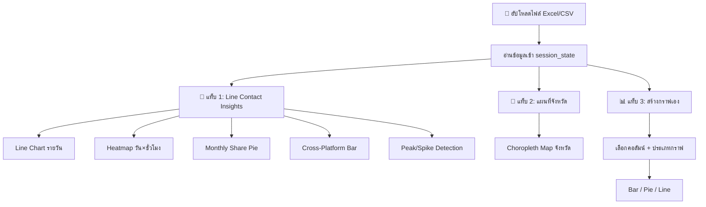

# 📊 หน้ากราฟ 3 แท็บ — แผนการดำเนินงาน

แยกหน้ากราฟเดิม (1 หน้ารวม) ออกเป็น **3 แท็บ** ภายในหน้าเดียวกัน โดยแต่ละแท็บมีกราฟเฉพาะทาง พร้อมระบบอัปโหลดไฟล์ที่ใช้ร่วมกัน — อัปโหลดครั้งเดียว กราฟเปลี่ยนตามข้อมูลทันทีทุกแท็บ

## หลักการทำงาน



---

## Proposed Changes

### โครงสร้างไฟล์

```
plan_of_Processing/
├── app.py                          ← ไม่แก้ไข (หน้าคลีนข้อมูลเหมือนเดิม)
├── pages/
│   └── 1_📊_สร้างกราฟ.py           ← [MODIFY] เขียนใหม่ทั้งหมด → 3 แท็บ
├── utils/
│   ├── cleaner.py                  ← ไม่แก้ไข
│   ├── extractor.py                ← ไม่แก้ไข
│   └── thai_geo.py                 ← [NEW] GeoJSON + ข้อมูลพิกัดจังหวัดไทย
├── requirements.txt                ← [MODIFY] เพิ่ม numpy
```

---

### Component 1: ข้อมูลภูมิศาสตร์จังหวัดไทย

#### [NEW] [thai_geo.py](file:///c:/Users/AOC/Downloads/plan_of_Processing/utils/thai_geo.py)

สร้างฟังก์ชันโหลด GeoJSON จังหวัดไทยจาก URL สาธารณะ + mapping ชื่อจังหวัดภาษาไทย-อังกฤษ สำหรับ Choropleth Map

- ดึง GeoJSON ออนไลน์จาก GitHub (thailand provinces boundary)
- mapping ชื่อจังหวัดไทย ↔ อังกฤษ (77 จังหวัด) เพื่อ join กับ GeoJSON
- cache ไว้ด้วย `@st.cache_data` ไม่ต้องโหลดซ้ำ

---

### Component 2: หน้ากราฟ 3 แท็บ (เขียนใหม่ทั้งหมด)

#### [MODIFY] [1_📊_สร้างกราฟ.py](file:///c:/Users/AOC/Downloads/plan_of_Processing/pages/1_📊_สร้างกราฟ.py)

เขียนใหม่ทั้งหมด โดยมีโครงสร้าง:

**ส่วนบน (Shared):** อัปโหลดไฟล์ 1 ครั้ง → ข้อมูลพร้อมใช้ทุกแท็บ

**3 แท็บ:**

##### 📱 แท็บ 1: Line Contact Insights

กราฟวิเคราะห์ข้อมูล Line Contact โดยอิงจากโครงสร้างของ `line_contact_insight.py` (ยกเว้น Moving Average ตามที่ระบุ):

| กราฟ | รายละเอียด | คอลัมน์ที่ใช้ |
|------|-----------|-------------|
| **Line Chart รายวัน** | จำนวนโพสต์ที่มี Line Contact ต่อวัน | `Date`, `Line_Contact` |
| **Heatmap วัน×ชั่วโมง** | ตาราง Heatmap แสดงความเข้มข้นของโพสต์ตามวันในสัปดาห์ × ชั่วโมง | `Date` (ต้องมี timestamp) |
| **Monthly Share** | Pie Chart แสดงสัดส่วนโพสต์ Line Contact แต่ละเดือน | `Date`, `Line_Contact` |
| **Cross-Platform** | Bar Chart เปรียบเทียบจำนวน Line Contact ตาม `source_sheet` (หรือ `ช่องทาง`) | `source_sheet`, `Line_Contact` |
| **Peak/Spike Detection** | ตรวจจับวันที่มีจำนวนโพสต์ผิดปกติ (สูงกว่า mean + 2σ) แสดงเป็น scatter + highlight | `Date`, `Line_Contact` |

> [!NOTE]
> กราฟทุกตัวจะตรวจสอบว่ามีคอลัมน์ที่จำเป็นหรือไม่ ถ้าไม่มีจะแสดง warning แทน

##### 📍 แท็บ 2: แผนที่จังหวัด

| ฟีเจอร์ | รายละเอียด |
|---------|-----------|
| **Choropleth Map** | แผนที่ประเทศไทยแบบเต็มจอ แสดงจำนวนโพสต์ตามจังหวัด ยิ่งเข้มยิ่งเยอะ |
| **สีไล่ระดับ** | ใช้ color scale แบบ sequential (เช่น YlOrRd — เหลือง→ส้ม→แดง) |
| **Hover** | ชี้เมาส์ดูชื่อจังหวัด + จำนวนโพสต์ |
| **ตาราง Top-10** | แสดงตาราง 10 จังหวัดที่มีโพสต์มากที่สุดควบคู่กัน |
| **Fallback** | ถ้าโหลด GeoJSON ไม่ได้ จะ fallback เป็น Bar Chart แทน |

##### 📊 แท็บ 3: สร้างกราฟเอง

ย้ายฟีเจอร์จากหน้าเดิมมาใส่ในแท็บนี้ (เหมือนเดิมทุกประการ):

| ฟีเจอร์ | รายละเอียด |
|---------|-----------|
| เลือกคอลัมน์ | Dropdown เลือกคอลัมน์สำหรับวิเคราะห์ |
| ประเภทกราฟ | Bar / Pie / Line |
| Top-N | Slider เลือกจำนวน |
| ชุดสี | เลือกได้ |
| ตาราง | แสดงข้อมูลตารางควบคู่กราฟ |

---

### Component 3: Dependencies

#### [MODIFY] [requirements.txt](file:///c:/Users/AOC/Downloads/plan_of_Processing/requirements.txt)

```diff
 streamlit
 pandas
 openpyxl
 plotly
+numpy
+requests
```

- `numpy` — ใช้สำหรับคำนวณ mean/std ใน Peak Detection
- `requests` — ใช้โหลด GeoJSON ออนไลน์ สำหรับ Choropleth Map

---

## Open Questions

> [!IMPORTANT]
> **Heatmap วัน×ชั่วโมง — ข้อมูลมีเวลา (timestamp) ด้วยไหม?**
> Heatmap วัน×ชั่วโมง ต้องการข้อมูลเวลาชั่วโมง (hour) จากคอลัมน์วันที่ ถ้าคอลัมน์ `วันที่จัดเก็บ` มีแค่วันที่ (ไม่มีเวลา) กราฟ Heatmap จะแสดงข้อมูลได้ไม่ครบ ในกรณีนี้ผมจะแสดง Heatmap เฉพาะ **วันในสัปดาห์×สัปดาห์ในเดือน** แทน (ซึ่งใช้แค่วันที่ ไม่ต้องมีเวลา) ตกลงไหมครับ?

> [!IMPORTANT]
> **Cross-Platform — คอลัมน์ที่ใช้แบ่งช่องทาง**
> ตอนนี้ข้อมูลมีคอลัมน์ `source_sheet` (ชื่อ Sheet ต้นทาง) กราฟ Cross-Platform จะใช้คอลัมน์นี้แบ่งกลุ่ม ถ้ามีคอลัมน์อื่นที่ระบุช่องทางชัดเจนกว่า (เช่น `ช่องทาง`, `platform`) แจ้งได้ครับ ผมจะปรับให้

---

## Verification Plan

### Manual Verification
1. รัน `streamlit run app.py` 
2. ไปหน้า **📊 สร้างกราฟ** → อัปโหลดไฟล์ที่ผ่านการคลีนแล้ว
3. ตรวจสอบแท็บ 1 (Line Contact Insights): กราฟทั้ง 5 ตัวแสดงผลถูกต้อง
4. ตรวจสอบแท็บ 2 (แผนที่จังหวัด): Choropleth Map แสดงจังหวัดไทยพร้อมสี
5. ตรวจสอบแท็บ 3 (สร้างกราฟเอง): เลือกคอลัมน์ + ประเภทกราฟ → สร้างกราฟได้เหมือนเดิม
6. ทดสอบ edge case: อัปโหลดไฟล์ที่ไม่มีคอลัมน์ `Line_Contact` → ระบบแสดง warning ไม่ crash
